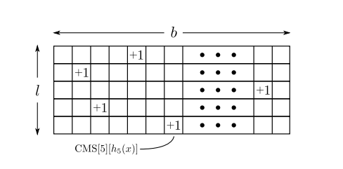

> 这是笔者学习 Stanford cs 168 课程的一些学习笔记
> lecture 2, 主要讲一个基于 hash 和独立试验思想，设计的一种数据结构 count min sketch，想法非常类似于 bloom filter，都是以牺牲准确率换空间和时间。


# heavy hitter problem

## Find majority element

先来看一个简单的在面试中经常会遇到的问题，**找主要元素**

> **问题如下**: 一组数据流: $a_1,\dots,a_n$, 存在一个元素 $a_i$ 保证出现次数大于
$n/2$。 能否设计一个算法在 仅仅扫描一遍的情况下找到它。

这里有一个很 cute 的算法

```py

current = -1
counter = 0

for e in stream:
    if counter == 0:
        current = e
        counter += 1
    elif e == current:
        counter += 1
    else counter -= 1

return current
```

可以证明这个算法一定是正确的。

**证明**

数学归纳法

1. 当 len(stream) = 1 的时候，一定是正确的
2. 假设当 len(stream)<=n 的时候是正确的
3. 当 len(stream) = n+1 的时候
    1. 如果 $a_1$ 是ans，当 counter 第一次减少为0 的时候，流被分为两段,一段是走过的，另外一段是没有遍历过的，[s_1|counter=0|,s_2],设 $l_1,l_2$ 分别是两段的长度，显然，第一段中 $cnt(a_1)= s_1/2$, 由于 $a_1$ 是答案，它在整个序列中出现的次数大于 $(n+1)/2$ 因此在 $s_2$ 中，我们有 $cnt(a_1) > \frac{n+1}{2}-\frac{s_1}{2} = \frac{s_2}{2}$,同时 $len(s_2) <=n$ 因此，由数学归纳法，再第二段中能正确找到答案。
    2. 如果 $a_2$ 不是 ans，遍历第一段的时候，$cnt(ans) < \frac{s_1}{2}$, 因此在第二段中 $cnt(ans)>\frac{s_2}{2}$, 同理，根据数学归纳法，一定能找到答案

证毕

## heavy hitter problem

这个问题是这样的，

> 给一个数据流 $a_1,\dots,a_n$, 以及一个整数 $k$ , 找出其中所有 出现次数(记作 frequency) 大于等于 $\frac{n}{k}$ 的元素


朴素的做法是用一个 hash 表统计一下 每个元素出现的次数，然后再输出次数 $\ge \frac{n}{k}$ 的元素，这个算法能够解决这个问题，但是最大的问题是它需要的空间依赖于不同元素的个数，因此我们希望能找一个空间 **亚线性**(sublinear) 的算法，同时只需要遍历一次整个流，换句话说，希望如下代码能够解决这个问题

```
for e in stream:
    # code
```

对每个元素只看一次，同时保证空间需求 $O(sizeOfAns)$

### impossible result

可以证明精确求解算法的亚线性辅助空间算法是不可能的。见 [1] 1.3, 因此我们希望找到一个近似做法

## $\epsilon$ - heavy hitters problem

问题同上，不过我们仅仅希望最终找到的答案，满足如下需求:

> 1. 每一个出现次数 $\ge \frac{n}{k}$ 的元素都在里面
> 2. 每一个出现次数 $\ge \frac{n}{k} - \epsilon n$ 的元素也可以在里面

我们允许使用的空间随着 $O(\frac{1}{\epsilon})$ 当 $\epsilon = 0$ 就和原来的问题一样了。算法的空间使用情况为 $O(\frac{1}{\epsilon})=O(k)$ 

下面就来介绍这篇博客的主角 **count-min-sketch** 频率统计利器

# count min sketch

和 bloom filter 类似的hash 做法，结构如下:



其中 $b << n$,支持两个操作:

> add(x),将 x 的频率 +1
> frq(x),统计 x 的频率

```
add(x):

for i in range(l):
    cms[i][hash_i(x)] += 1


frq(x):
    return min(cms[i][hash(x)]) for i in range(l)

```

很显然 $frq(x)$ 一定会高估 $cnt(x)$(元素 $x$ 的真实频率), 下面我们来分析一下会高估的概率是多少，同时我们希望 $\Pr[min(cms[i][hash_i(x)]) \ge cnt(x)]$ 的概率足够小，

## rigorous error analysis

先给出如下结论:

> $\Pr[min(cms[i][hash_i(x)]) \ge cnt(x)] \le e^{-l}$

**证明**

定义:

> $f_x$ 元素 $x$ 在stream 中的真实频率，这是一个常数
> $Z_i=cms[i][hash_i(x)]$

假设

> hash 函数是独立的，同时 $\Pr[hash(x)=hash(y)|y\ne x]\le \frac{1}{b}$

$$
\begin{aligned}
Z_i&=f_x+\sum_{hash(y)==hash(x),x\ne y} f_y\\
E[Z_i] &=f_x + E[\sum_{hash(y)==hash(x),x\ne y} f_y]\\
&= f_x+\sum_{x\ne y}f_yE[I(hash(y)=hash(x))]\\
&= f_x+\sum_{y\ne x}f_y\Pr[hash(y)=hash(x)]\\
&\le f_x + \frac{n}{b}
\end{aligned}
$$

fix x 以及 row i令 $b=\frac{e}{\epsilon}, X = Z_i- f_x$  由于 $E[X] \le \frac{n\epsilon}{e}$

由 markov's inequality

> $\Pr[X > cE[X]] \le \frac{1}{c}$

$$
\begin{aligned}
\Pr[Z_i-f_x\ge \frac{n\epsilon}{e}*e]&=\Pr[Z_i\ge \epsilon n + f_x]\\
 &\le \frac{1}{e}\\
\Pr[min(Z_i)\ge \epsilon n + f_x] &\le  \frac{1}{e^l}(hash 函数独立性假设) 
\end{aligned}
$$

完

### 参数 trick

设错误概率为 $\sigma$, 要达到这个概率，大概需要 $l = \ln \sigma^{-1}$

同时，通常，$b=\frac{e}{\epsilon} =>^{O(\epsilon^{-1})=O(k)}=e k$


作业中探讨了一种 Conservative Update 的 简单优化方式

## conservative update

这是说，对于操作 add(x)

仅仅将 $cms[i][hash_i(x)] = min(cms[i][hash_i(x)])$ 的那些“格子” 更新，可以很容易的证明这不会低估 $f_x$

## 扩展

很容易将操作扩展到 add(x,cnt) 上

## code

[这是一份我的作业中的代码](https://github.com/zouzhitao/cs168-19-stanford/blob/master/min-project1/cms.py) python 实现

[这是一份开源代码](https://github.com/addthis/stream-lib) java 实现

# reference

1. [CS168: The Modern Algorithmic Toolbox Lecture #2: Approximate Heavy Hitters and the Count-Min Sketch](http://web.stanford.edu/class/cs168/l/l2.pdf)


>**版权声明**
>
>本作品为作者原创文章，采用[知识共享署名-非商业性使用-相同方式共享 4.0 国际许可协议](https://creativecommons.org/licenses/by-nc-sa/4.0/) 
>
>**作者:** [taotao](https://zouzhitao.github.io/)
>
>**转载请保留此版权声明，并注明出处**


